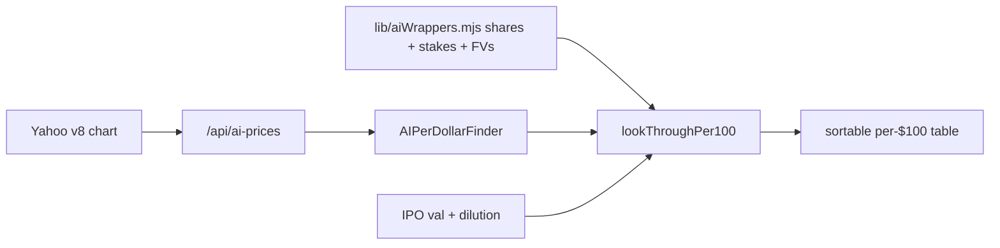

# Anthropic & OpenAI Per $ Calculator

Plan for a new always-on look-through table: for each public wrapper, how many dollars of Anthropic and/or OpenAI you get per $100 of wrapper market cap, at a user-set IPO valuation (and optional IPO dilution).

**Not per share.** Combined column = Anthropic per $100 + OpenAI per $100.

Yahoo `v7/finance/quote` and `v10/finance/quoteSummary` return 401 (crumb/cookie-gated). Only `v8/finance/chart` works, and its `meta` is price-only. Live fetch is therefore **prices only**; share counts and ownership/FVs are curated.

## Live vs curated

**Live** (Yahoo v8 chart, same pattern as [`app/api/prices/route.js`](../app/api/prices/route.js)): price per share only.

**Curated** in [`lib/aiWrappers.mjs`](../lib/aiWrappers.mjs), with an `asOf` per field: shares outstanding (and fund FVs / round valuations). Share counts for GOOG/AMZN/MSFT/NVDA move ~1%/quarter, inside the noise of ownership figures that already carry ±2x ranges. No crumb dance in v1.

```
marketCap = livePrice × curatedShares
```



New route [`app/api/ai-prices/route.js`](../app/api/ai-prices/route.js): the 11 wrapper tickers, 60s cache, hardcoded fallbacks, **`meta.symbol === ticker` recycled-ticker guard** (same as `/api/prices`). Do **not** add these tickers to `/api/prices` — that would slow VCX/DXYZ/ECHO on every load.

Parse/fallback/math live in lib, not the route. [`TODOS.md`](../TODOS.md): `app/api/*/route.js` cannot run under `npm test` (`next/server` won’t import). Put chart-meta parsing in [`lib/yahooQuote.mjs`](../lib/yahooQuote.mjs) (price + symbol guard); look-through math in [`lib/aiWrappers.mjs`](../lib/aiWrappers.mjs). The route is a thin fetch/cache wrapper.

**DXYZ shares** are the one count that moves fast (active ATM). v1: curated `asOf` snapshot (from [`lib/dxyzAtm.mjs`](../lib/dxyzAtm.mjs) `impliedMarch31Shares` or a dated ATM estimate). Later the ATM bridge can feed it. Label the shares column with `asOf`.

**ADRs (SFTBY, SKM):** no Yahoo `marketCap` cross-check without the crumb dance. Curate issuer-equivalent shares so `price × shares` is the **full-issuer** cap, plus a per-row footnote (ADR vs Tokyo/Korea primary). Optional crumb fetch is later, not v1.

**ARKVX:** interval fund; Yahoo “price” is NAV (~1.00× in the March sheet) and shares may be absent from any live feed. Curated shares (or net assets) are required, not optional. **AGIX:** ETF share count drifts; same curated-shares + `asOf` treatment.

## Data model (two row kinds)

**Strategic / corporate:** `ownershipPct` of Anthropic and/or OpenAI.

```
per$100 = ownershipPct × (1 − dilution) × ipoVal / marketCap × 100
```

**Funds (AGIX, DXYZ, ARKVX, VCX):** do **not** store a derived company %. Store the filed numbers:

- `fairValue` — last N-CSR / NPORT-P position FV (USD)
- `roundVal` — private-company valuation used to mark that FV
- `fvAsOf`

```
per$100 = fairValue / marketCap × (ipoVal / roundVal) × (1 − dilution) × 100
```

Same algebra as `ownershipPct = FV / roundVal`, but the curated inputs stay auditable and the DXYZ/VCX rows can cite N-PORT dollars directly.

**DXYZ OpenAI PPUs** do not scale with an IPO valuation (N-CSR: PPUs are not equity). Split the OpenAI FV: Series C SPV **does** scale; PPU slice is **excluded** from IPO scaling (and from the OpenAI per-$100 numerator). Footnote + **Low** confidence on DXYZ’s OpenAI column.

## Validation (news + EDGAR, as of Aug 2026)

v1 universe is **11 wrappers**. **ECHO/SATS is excluded** — SpaceX only; it already has `/echo`. Private AI stakes do **not** appear in 13Fs. Corporates: 10-K/10-Q/8-K. Funds: N-CSR / NPORT-P / 424B. Ownership will not auto-update from EDGAR.

Sheet-backed defaults that reproduce the screenshot when you invert `per$100 × mktCap ÷ scenario val`: GOOG 14%, AMZN 20%, MSFT OpenAI 27%, SFTBY 13.05%, NVDA Anthropic 2.6%. **NVDA OpenAI ships 3.0%, not the sheet’s ~3.6%** — deliberate Low-confidence re-derive ($30B closed vs $100B LOI), not a match error.

| Wrapper | Anthropic | OpenAI | Default to ship | Confidence | Basis |
|---|---|---|---|---|---|
| **GOOG** Alphabet | Yes, non-voting, 15% cap | No | **14%** / 0 | Med on current % | NYT Mar 2025 court docs. 10-Q does not name Anthropic. Later $40B commitment may have defended the cap. |
| **AMZN** Amazon | Yes: $8B convertibles + Series G/H preferred. $190.4B carrying value at 6/30/26. $100B AWS is **not** equity. | Yes: $50B Series C preferred (closed 2026). Press ~5%. $100B AWS is **not** equity. | **20%** / **5%** | Low–Med / Med | Anthropic 20% is **not filed**; it is FV÷round (~21% in the Aug 7 table). Range 8–21%, footnote that Amazon cites an ownership cap. OpenAI ~5% from press after the $50B close; 10-Q confirms the dollars, not the %. |
| **MSFT** Microsoft | Yes, ~$5B (Nov 2025) + $3.2B Q4 gain. | **Yes, ~27% as-converted** | **2.0%** / **27%** | Low / **High** | OpenAI 27% is in the Mar 31, 2026 10-Q — the only Big Tech **percentage in an SEC filing**. Anthropic 2.6% Excel figure is $5B÷old round; haircut to ~2% after later rounds. |
| **SFTBY** SoftBank ADR | No | Yes, VF2 preferred | 0 / **13%** | High | SoftBank’s own 2/27/26 release: ~13% at $64.6B. ~$55B in as of Aug 2026; last $10B tranche due Oct 1, 2026. Curate full-issuer shares; ADR footnote. |
| **NVDA** NVIDIA | Up to $10B commitment | $30B closed (not the $100B GPU LOI) | **2.6%** / **3.0%** | Low / Low | Neither % is disclosed. 3.0% OpenAI is a deliberate change from the sheet’s ~3.6%. |
| **SKM** SK Telecom ADR | Yes, $100M (2023) + undisclosed Series H add-on (Jun 2026) | No | **0.30%** | Low–Med | Matches the Aug 7 table and Hana ~0.3%. Excel 0.58% is a pre-H sell-side figure. Range 0.30–0.70. Curate full-issuer shares; ADR footnote. |
| **ZM** Zoom | Yes, preferred; carrying **$1.267B** after +$46M (10-Q period ended 4/30/26) | Product/API only, **no equity** | **0.33%** | Med | $1.267B ÷ Feb 2026 ~$380B round ≈ 0.33%. Range 0.33–1.0. |
| **AGIX** KraneShares Public-Private AI ETF | Yes, direct private shares | No | Filed FV + round val (~1.9–2.8% of NAV) | High on NAV weight | Ticker is correct (name change Jun 1, 2026). **Not** the SingularityNET token. Curated shares + `asOf` (ETF count drifts). |
| **DXYZ** Destiny Tech100 | Magnitude ANC III SPV: **18.1% of portfolio** (3/31/26) | 1.0% **PPUs (not shares)** + 4.7% Series C SPV | Filed FVs; PPUs excluded from IPO scaling | High on $; Low on OAI | Excel 22% / 2.1% NAV weights are stale. Share count `asOf` snapshot; ATM bridge can feed later. |
| **ARKVX** ARK Venture (interval fund) | Yes | Yes | Filed FVs from NAV weights: Anth **3.5–6.4%**, OAI **8.5–11.5%** of NAV | High on NAV weight | Excel OpenAI 2.46% is badly stale. Yahoo price is NAV; curated shares required. Interval-fund liquidity footnote. |
| **VCX** Fundrise Innovation | 16.5% of NAV (3/31/26) | 12.4% of NAV | Filed FVs ($112.4M / $84.2M) | High | Excel 20.7% / 9.9% was listing-era. Using **market cap** (not NAV) in the denominator is the point. |

Skip Excel late-adds (RVI, PRIVX, XOVR, MNTN, SMT, BPTRX, STCK.TO, OTF).

## Sliders

ECHO-style native `<input type="range">` + number input, amber accent, no extra library.

1. Anthropic IPO valuation — range $400B–$2.5T
2. OpenAI IPO valuation — range $500B–$4T
3. IPO dilution — default **0%**, range 0–30% (gross look-through, matching the Aug 7 table)

**Chips are coherent pairs from the March Excel, not mixed tiers:**

| Chip | Anthropic | OpenAI |
|---|---|---|
| Bear | $400B | $850B |
| Base | $650B | $1,250B |
| Bull | $1,000B | $2,000B |
| Ultra | $1,500B | $3,500B |

**Load state matches no chip:** Anthropic **$1.0T** (post-sheet Series H ~$965B), OpenAI **$1.25T** (sheet Base). Caption: defaults are unpaired; chips apply both names together. Editing a slider after a chip clears the chip.

Dilution meaning, documented in the UI: if IPO valuation is post-money including new shares, existing holders own `pct × (1 − dilution)` of that value. Default 0% = gross claim on the whole IPO market cap.

## Table UX

New component [`components/AIPerDollarFinder.jsx`](../components/AIPerDollarFinder.jsx), chrome from VCX flex-table + ECHO sliders. Click-to-sort on headers (`sortKey` / `sortDir`); default **Combined $ per $100 descending**.

Columns (no per-share columns):

- Ticker, name, type (Strategic / Fund)
- Live price, curated shares (`asOf`), market cap
- Anthropic stake % or FV (muted if 0)
- **Anthropic $ / $100**
- OpenAI stake % or FV (muted if 0)
- **OpenAI $ / $100**
- **Combined $ / $100** (primary sort)
- Confidence (High / Med / Low)

Funds get a one-line note that the stake is filing FV marked at a stated round, not % of fund NAV. DXYZ OpenAI notes PPUs excluded. Live/cache/fallback badge on prices. Shares show `asOf`, not “live.”

Optional density filter: hide rows under $X per $100 (Aug 7 GOOG exclusion). Default **off**.

## Tests

[`test/aiWrappers.test.mjs`](../test/aiWrappers.test.mjs) via `node --test`. Frozen examples must **pin every input** in the test (price, shares, both valuations, dilution) — do not read live quotes.

- AMZN: 20% × $1T / ($price × $shares) × 100 with Aug 7 pins → **~$7.03**
- DXYZ Anthropic: FV/round path with Aug 7 pins → **~$28.32**
- Dilution 10% scales linearly; zero stake → $0; Combined = sum of legs
- DXYZ OpenAI: PPU FV excluded from scaled numerator

## Page + ship

- Route [`app/ai/page.jsx`](../app/ai/page.jsx) → `/ai` (title: “Anthropic & OpenAI Per $”)
- Nav: [`components/Header.jsx`](../components/Header.jsx) add `{ href: "/ai", label: "AI Per $" }`
- Home card: [`app/page.js`](../app/page.js) `tools` array
- Footer: [`components/Footer.jsx`](../components/Footer.jsx)
- [`AGENTS.md`](../AGENTS.md): `/ai` under Pages, `/api/ai-prices` under API routes
- Ship convention: bump [`VERSION`](../VERSION) + [`CHANGELOG.md`](../CHANGELOG.md) (new tool → **0.3.0.0**)

## Implementation order

1. **`npm install`** — `node_modules` is missing in this workspace. Then read bundled Next 16.2.6 docs in `node_modules/next/dist/docs/` before writing App Router / route-handler code (`AGENTS.md` mandate; this is a breaking-changes fork).
2. `lib/aiWrappers.mjs` + tests (stakes, fund FV model, PPU exclusion, pinned Aug 7 examples).
3. `lib/yahooQuote.mjs` + thin `/api/ai-prices` (v8 chart, symbol guard, cache, fallbacks).
4. `AIPerDollarFinder` UI (unpaired default sliders + coherent chips, sortable table).
5. Register `/ai`, Header, home, Footer, AGENTS.md, VERSION, CHANGELOG.

## Out of scope (v1)

- Yahoo crumb/cookie for v7/v10
- Live EDGAR ownership scrape
- SATS/ECHO, SpaceX, Databricks
- Feeding DXYZ shares from the ATM bridge
- Filing alerts / webhooks
- Per-wrapper dilution or per-wrapper valuation
- Rewriting `/api/prices` or the NAV finders
